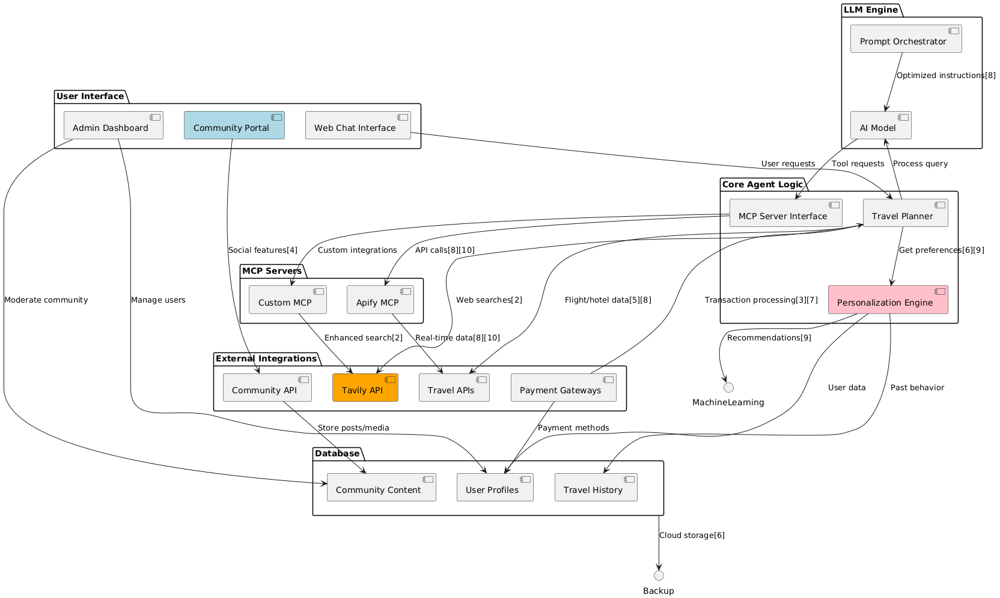
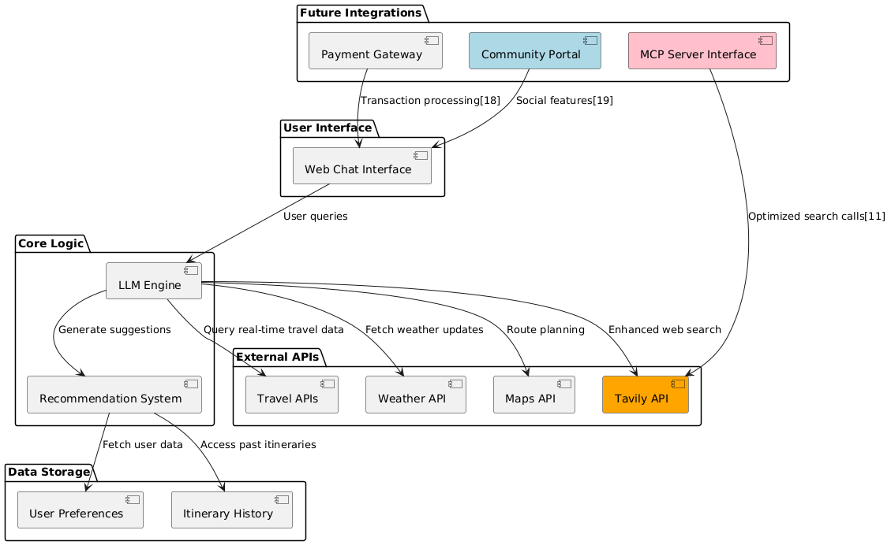

<p align="center">
  
</p>

<p align="center">
  
</p>

*Architecture Overview: Modern React + FastAPI full-stack application with AI-powered travel planning*

# Travelian India v2.0

A modern AI-powered travel itinerary planner built with React + FastAPI, specifically designed for Indian travelers. This application leverages advanced AI agents to create personalized, budget-aware travel itineraries with beautiful UI and interactive maps.

## 🚀 Quick Start

### Prerequisites
- **Node.js 18+** with npm
- **Python 3.8+** with pip
- **Google Gemini API Key** (required)

### Installation & Setup

1. **Clone the repository**
   ```bash
   git clone <your-repo-url>
   cd Travelian
   ```

2. **Backend Setup (FastAPI)**
   ```bash
   cd backend
   pip install -r requirements.txt
   
   # Copy environment template and add your API keys
   cp env.example .env
   # Edit .env file with your actual API keys
   
   python main.py
   ```
   Backend runs on: `http://localhost:8000`

3. **Frontend Setup (React)**
   ```bash
   cd frontend
   npm install
   
   # Copy environment template and configure
   cp env.example .env
   # Edit .env file with your configuration
   
   npm start
   ```
   Frontend runs on: `http://localhost:3002`

## ✨ Features

### 🎯 Core Features
- **AI-Powered Itinerary Generation**: Create detailed day-by-day travel plans with budget breakdowns
- **Multi-Agent System**: Specialized AI agents for research, accommodation, transportation, activities, dining, and itinerary integration
- **Interactive Maps**: Visualize travel routes with OpenStreetMap integration (no API key required)
- **Budget-Aware Planning**: Smart budget parsing and allocation across accommodation, food, transport, and activities
- **Rich Text Formatting**: Beautiful book-like itinerary display with bold, italic, and bullet points
- **Responsive Design**: Modern UI that works seamlessly across desktop and mobile devices

### 🎨 UI/UX Features
- **Smooth Hero Animations**: GSAP-powered animations with auto-play functionality
- **Indian Theme**: Orange and green color scheme inspired by the Indian tricolor
- **Loading States**: Elegant loading spinners and progress indicators
- **Toast Notifications**: User-friendly feedback for all actions
- **Session Storage**: Persistent data across browser sessions

### 🗺️ Map Features
- **OpenStreetMap Integration**: Free, no API key required
- **External Links**: Direct links to Google Maps and OpenStreetMap
- **Error Handling**: Graceful fallbacks when maps fail to load
- **Route Visualization**: Origin to destination route display

## 💻 Usage

1. **Start the Application**: Ensure both backend (port 8000) and frontend (port 3002) are running
2. **Enter Travel Details**: Fill out the travel form with origin, destination, dates, and preferences
3. **Select Budget Level**: Choose from Budget, Moderate, Luxury, or Premium options
4. **Generate Itinerary**: Click "Create My Personal Travel Itinerary" to generate your plan
5. **Review Results**: View your detailed itinerary with budget breakdown and interactive map
6. **Explore Maps**: Use the integrated map to visualize your travel route
7. **Save & Share**: Download or share your itinerary for offline access

## 🔑 API Key Setup

### Environment Configuration
Both frontend and backend use environment files for configuration:

1. **Backend Environment** (`backend/.env`)
   ```bash
   # Required
   GEMINI_API_KEY=your_google_gemini_api_key_here
   
   # Optional
   TAILVY_API_KEY=your_tailvy_api_key_here
   MONGODB_URI=your_mongodb_connection_string_here
   OPENAI_API_KEY=your_openai_api_key_here
   ```

2. **Frontend Environment** (`frontend/.env`)
   ```bash
   REACT_APP_API_BASE_URL=http://localhost:8000
   REACT_APP_GOOGLE_MAPS_API_KEY=your_google_maps_api_key_here
   ```

### Required API Keys
- **Google Gemini API Key**: Get from https://ai.google.dev/

### Optional API Keys
- **Tailvy API Key**: For enhanced travel recommendations
- **MongoDB Connection URI**: For geo-based attraction search
- **OpenAI API Key**: For vector search of attractions
- **Google Maps API Key**: For enhanced map features (optional, OpenStreetMap works without it)

## 🗺️ MongoDB Integration

The app includes optional MongoDB integration for geo-based attraction recommendations:

1. Stores attraction data with geographical coordinates
2. Uses MongoDB's geospatial queries to find attractions near your destination
3. Implements vector search using OpenAI embeddings for semantic matching
4. Visualizes attractions on an interactive map

If you have a MongoDB Atlas account, you can:
- Enter your connection URI in the settings
- Provide an OpenAI API key for vector embeddings
- Initialize a sample dataset with Indian attractions
- Search for attractions near your destination based on your interests

## 📊 Architecture Evolution

Our project architecture has evolved through multiple versions:

### Hackathon Implementation (v0.1)

*Enhanced architecture implemented during the hackathon with improved agent communication*


### Future Vision (v2) - Beyond Hackathon Scope

*Planned future architecture with expanded capabilities and integrations*

## 📊 Current Project Architecture

```
┌─────────────────────────────────────────────────────────────────┐
│                    React Frontend (Port 3002)                  │
│              TypeScript + Tailwind CSS + GSAP                  │
└───────────────────────────┬─────────────────────────────────────┘
                            │ HTTP API Calls
                            ▼
┌─────────────────────────────────────────────────────────────────┐
│                    FastAPI Backend (Port 8000)                 │
│                    Python + Pydantic + Uvicorn                 │
└───────────────────────────┬─────────────────────────────────────┘
                            │ AI Processing
                            ▼
┌─────────────────────────────────────────────────────────────────┐
│                      Multi-Agent System                        │
└───┬───────┬───────┬───────┬───────┬───────┬───────┬─────────────┘
    │       │       │       │       │       │       │
    ▼       ▼       ▼       ▼       ▼       ▼       ▼
┌─────────┐ ┌─────────┐ ┌─────────┐ ┌─────────┐ ┌─────────┐ ┌─────────┐ ┌─────────┐
│Research │ │Accomm.  │ │Transport│ │Activities│ │ Dining  │ │Itinerary│ │ Chatbot │
│  Agent  │ │ Agent   │ │ Agent   │ │  Agent   │ │ Agent   │ │ Agent   │ │  Agent  │
└────┬────┘ └────┬────┘ └────┬────┘ └────┬────┘ └────┬────┘ └────┬────┘ └────┬────┘
     │           │           │           │           │           │           │
     └───────────┴───────────┴───────────┴───────────┴───────────┴───────────┘
                                        │
                                        ▼
┌────────────────┬────────────────┬─────────────────┬───────────────┐
│ Google Gemini  │  Tailvy API    │  MongoDB Atlas  │  OpenAI API   │
│   (Required)   │  (Optional)    │   (Optional)    │  (Optional)   │
└────────────────┴────────────────┴─────────────────┴───────────────┘
```

### Key Components:
- **Frontend**: React 19.1.1 with TypeScript, Tailwind CSS, Framer Motion, and GSAP animations
- **Backend**: FastAPI with Pydantic models and Uvicorn server
- **AI System**: LangChain with Google Gemini for multi-agent travel planning
- **Maps**: OpenStreetMap integration (no API key required)
- **Storage**: Session storage for persistent user data

The application follows a modern full-stack architecture where the React frontend communicates with the FastAPI backend through REST APIs. The backend orchestrates multiple AI agents that work collaboratively to create comprehensive travel itineraries tailored to user preferences.

## 👥 Team Members

This project was created by TechMatrix Solvers for IIITDMJ HackByte3.0 (April 4-6, 2024):

- **Team Leader**: Pratik Kumar (Linkedin: https://www.linkedin.com/in/pratik-kumar-198172186?utm_source=share&utm_campaign=share_via&utm_content=profile&utm_medium=ios_app
)
Ankit Ray (Linkedin: https://www.linkedin.com/in/ankit-ray-9a40b3317?utm_source=share&utm_campaign=share_via&utm_content=profile&utm_medium=ios_app )

Naman Jain (Linkedin: https://www.linkedin.com/in/naman-jain-75263a326?utm_source=share&utm_campaign=share_via&utm_content=profile&utm_medium=android_app)

Vidhi Agarwal (Linkedin: https://www.linkedin.com/in/vidhi-agarwal-3b8b95328?utm_source=share&utm_campaign=share_via&utm_content=profile&utm_medium=android_app)

## 🛠️ Technology Stack

### Frontend
- **React**: 19.1.1 with TypeScript
- **Styling**: Tailwind CSS 3.4.17
- **Animations**: Framer Motion 12.23.19 + GSAP 3.13.0
- **Icons**: Lucide React 0.544.0
- **Routing**: React Router DOM 7.9.1
- **Notifications**: React Hot Toast 2.6.0
- **HTTP Client**: Axios 1.12.2

### Backend
- **Framework**: FastAPI 0.104.1
- **Server**: Uvicorn 0.24.0
- **Validation**: Pydantic 2.5.0
- **AI Framework**: LangChain 0.1.0
- **Language Model**: Google Generative AI (Gemini) 0.3.2
- **Environment**: Python-dotenv 1.0.0

### Optional Integrations
- **MongoDB**: For geo-based recommendations
- **OpenAI**: For vector embeddings
- **Tailvy API**: For enhanced travel planning

## 🚀 Future Endeavours

Explore our comprehensive vision for integrating Travelian India into the Samsung ecosystem:

**[📖 Read Future Endeavours Document](FUTURE_ENDEAVOURS.md)**

### Key Highlights:
- **Samsung Pay Integration** 💳 - Direct travel bookings and expense tracking
- **Samsung Calendar Sync** 📅 - Automatic itinerary import with smart reminders
- **Samsung Pass Integration** 🔐 - Secure storage of travel documents
- **Galaxy Watch Integration** ⌚ - Real-time travel updates on wearables
- **Bixby Voice Commands** 🤖 - Voice-activated travel planning
- **SmartThings Integration** 📺 - Smart home travel experience

*Vision: Empowering every Indian traveler with intelligent, connected, and personalized travel experiences through the Samsung ecosystem.*

## 📹 Submissions

### Samsung PRISM GenAI Hackathon 2025

**Team**: BitWizards  
**Project**: Travelian India v2.0 - AI-Powered Travel Planning Platform  
**Tag**: `SamsungPRISMGenAIHackathon2025`

#### 📋 Submission Files
- **Team Information**: [TeamName.md](TeamName.md)
- **Setup Guide**: [SETUP_GUIDE.md](SETUP_GUIDE.md)
- **API Documentation**: [API_DOCUMENTATION.md](API_DOCUMENTATION.md)
- **Future Endeavours**: [FUTURE_ENDEAVOURS.md](FUTURE_ENDEAVOURS.md)

#### 🎥 Demo & Resources
- **Live Demo**: [GitHub Repository](https://github.com/SamsungPRISMGenAIHackathon2025/Travelian)
- **Documentation**: Complete setup and API documentation included
- **Architecture**: Modern React + FastAPI with AI integration
- **Features**: Rich text formatting, interactive maps, budget planning

#### 🏆 Key Achievements
- ✅ **Modern Architecture**: React 19.1.1 + FastAPI + TypeScript
- ✅ **AI Integration**: Multi-agent system with Google Gemini
- ✅ **Rich UI/UX**: GSAP animations and Tailwind CSS styling
- ✅ **Interactive Maps**: OpenStreetMap with Google Maps fallback
- ✅ **Budget Planning**: Smart budget parsing and allocation
- ✅ **Samsung Vision**: Comprehensive ecosystem integration roadmap

#### 📞 Contact
**Team Leader**: Pratik Kumar  
**Email**: pratik2002singh@gmail.com  
**LinkedIn**: [Pratik Kumar](https://www.linkedin.com/in/pratik-kumar-198172186)


